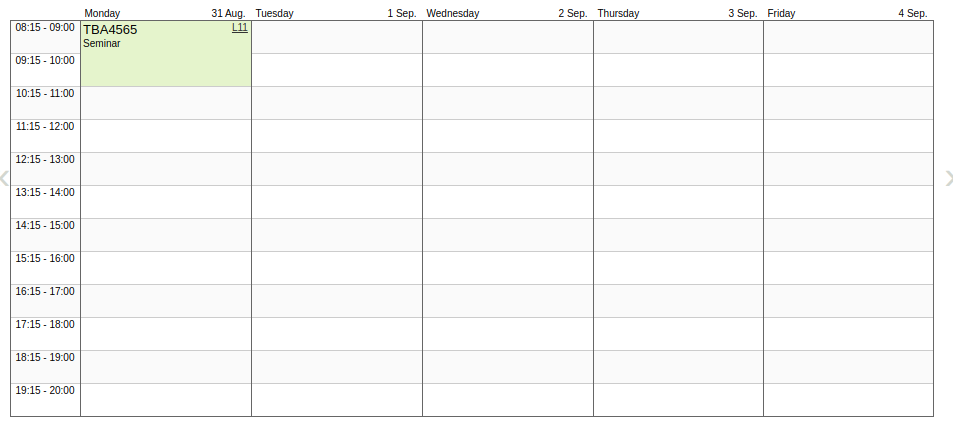

Som tittelen sier tror jeg at jeg har landet på hvordan dette semesteret skal se ut. Vanligvis består et semester av 30 studiepoeng, men siden jeg byttet hovedretning for et år siden ligger jeg 7.5 studiepoeng bak normert progresjon. Det betyr at jeg må ta igjen disse poengene før jeg tar ut masteren på våren. 

**Semesteret (37.5 stp)**

- Prosjektoppgave (15 stp)

  Prosjektoppgaven skal skrives sammen med Vake, målet er å gjøre grundig research på hvordan man bedre kan matche opp posisjonsdata som skip sender ut, med algoritmen Vake har for skipsdeteksjon. 

- Fordypningsemne (7.5 stp)

  Sammen med prosjektoppgaven har man et fordypningsemne som skal være med å underbygge masteren. Hos Geomatikk består dette av to moduler.

  - I den ene modulen skal jeg se nærmere på satellittbilder og hvordan disse sammen med fotogrammetri/kunstig intelligens kan brukes til å oppdage forandringer i bygningsmasse
  - I den andre modulen får man en større innblikk av maskinlæring i praksis. 

- Programmering i geomatikk (7.5 stp)

  Programmering i geomatikk er et fag bestående av 100% selvstudium. Målet er å lage et webGIS som har grunnleggende funksjonalitet og analysemuligheter. 

- Medisin for realfags- og teknologistudenter (7.5 stp)

  Det siste emnet jeg skal ha er et breddeemne, dette er inkludert i studieplanen for å gi ingeniørstudenter et større perspektiv. 

Pågrunn av en god miks av korona og fagene jeg har valgt er det veldig lite undervisning denne høsten, så her legges det opp til mye selvstudium..

(Dette er en typisk uke for meg denne høsten)