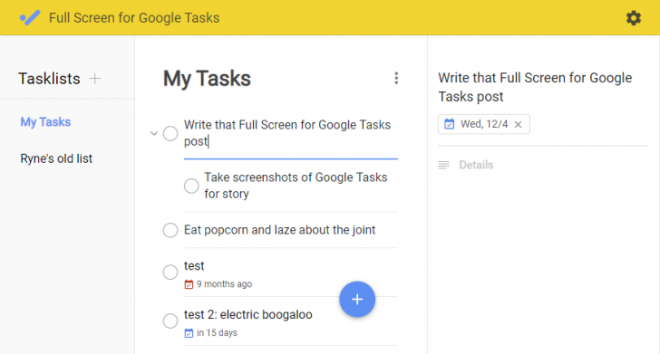

Tasks er google sin egen løsning for å holde styr på to-do lists og ting man skal gjøre. Det finnes mange slike tjenester som leveres av store og små selskaper, men jeg falt på Tasks av et par forskjellige grunner. 

1. Google Tasks tilbyr full synkronisering mellom pcer, nettbrett og mobiler. Det finnes apper for alle plattformer.
2. Den passer bra inn i mitt økosystem, er generelt en fan av google sine tjenester (GMail, Photos, Drive etc).
3. Med tillegget "Fullscreen for Google Tasks" får man et grensesnitt som bare fungerer.
4. Et enkelt grensesnitt for å sette dato for når ting skal være ferdig, det er få tjenester som får dette til. 

